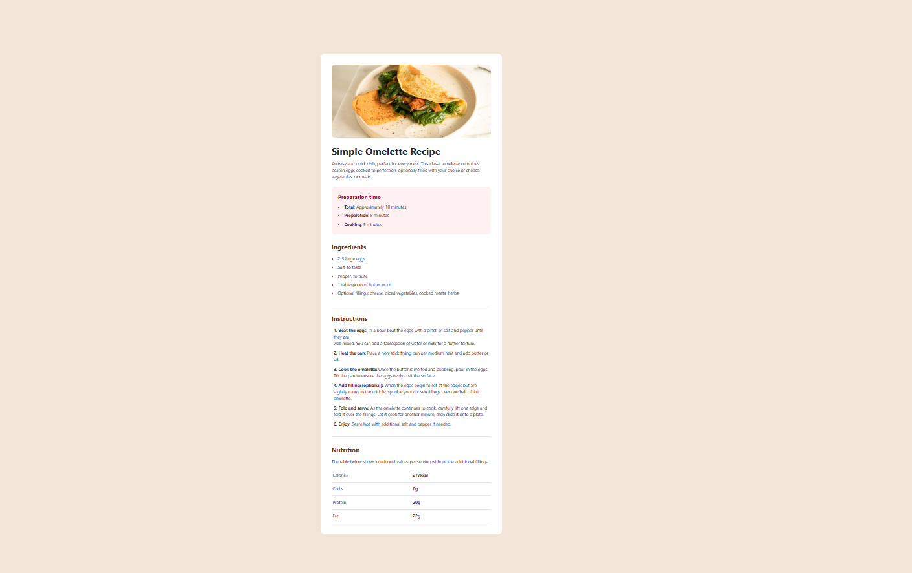

# Frontend Mentor - Recipe page solution

This is a solution to the [Recipe page challenge on Frontend Mentor](https://www.frontendmentor.io/challenges/recipe-page-KiTsR8QQKm). Frontend Mentor challenges help you improve your coding skills by building realistic projects.

## Overview

### Screenshot


### Links

Solution URL:


Live URL:


## My Process

### Built with

-HTML 5

-Tailwind CSS

-Flexbox

### What I Learnt

-How to install and use Tailwind CSS in HTML

-How to add tables in HTML

```html
<table>
    <th>Name</th>
    <th>Age</th>
    <tr>
        <td>Khadija</td>
        <td>20</td>
    </tr>
</table>
```
### Continued development

-Continue practicing using tailwind CSS for faster styling

### Useful Resources

-How to install tailwind CSS in HTML correctly (https://stackoverflow.com/questions/74626693/how-to-install-tailwind-css-in-html-correctly)  - This stack overflow answer helped install tailwindcss.


- HTML Tables (https://www.w3schools.com/html/html_tables.asp) - This article helped me understand the table tag.


## Author
Charity Karoki
